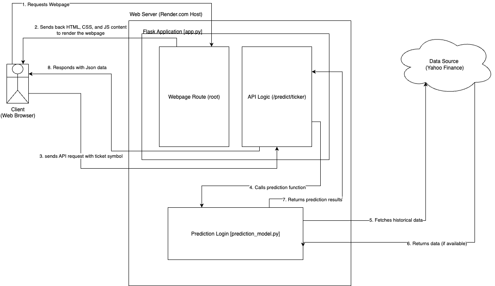

# Real-Time Stock & Dividend Forecaster

## Overview
This project is a full-stack web application that provides a real-time, next-day forecast for a stock's closing price and its next dividend payment. The back-end is powered by a machine learning model built with Python and Scikit-learn, served via a **Flask web framework**. The front-end is a clean, responsive interface built with HTML, CSS, and JavaScript.

The entire application is designed as an **all-in-one client-server model**, where the Flask server handles both the API requests for predictions and serves the user-facing website.

## Application Architecture
This application follows a monolithic, "all-in-one" server architecture.



1.  **Client (Front-End):** The user's web browser loads the HTML, CSS, and JavaScript files.
2.  **Server (Back-End):** A Flask application running on a host (like Render) serves the front-end files.
3.  **API Communication:** The JavaScript on the front-end sends an API request (e.g., `/predict/AAPL`) back to the *same* Flask server, which runs the ML model and returns the prediction as JSON data.

This unified structure simplifies development and deployment.

## Features
* **Interactive Web Interface:** A user-friendly web UI to get forecasts for any stock ticker.
* **Dual Forecasting:** Predicts both the next-day stock price and the next dividend payout.
* **Robust Price Date Logic:** Automatically calculates the next actual trading day by skipping weekends and market holidays (specifically US Federal Holidays).
* **Projected Dividend Date:** Forecasts the next potential dividend date by calculating the average time between all historical payouts and projecting that interval into the future.
* **Two-Model System:** Uses a "Director" (Classifier) for direction and a "Forecaster" (Regressor) for magnitude.
* **Calibrated Confidence:** Provides a reliable confidence percentage for directional predictions using `CalibratedClassifierCV`.
* **Coherent Predictions:** An alignment step ensures the final value is logically consistent with the predicted direction.
* **Advanced Feature Engineering:** Analyzes volatility, momentum, and price ratios across multiple time horizons.

---
## The Machine Learning Process

The model's procedure is broken down into two main pipelines: one for price and one for dividends.

### 1. Data Collection
Historical daily price data and dividend history are fetched from **Yahoo Finance** using the `yfinance` library.

### 2. Feature Engineering
The model creates a rich set of features ("clues") from the raw historical data.
* **Price Features:** Multi-horizon analysis of Volatility, Momentum, and Price Ratios (from 2 days to 5 years), plus the specific returns of the last 5 days.
* **Dividend Features:** Growth rates and rolling statistics over the last 4, 6, and 8 dividend payouts.

### 3. The "Prediction Team" Model
* **The Director (Classifier):** A `CalibratedClassifierCV` wrapping a `RandomForestClassifier` to predict the binary direction (Up/Down).
* **The Forecaster (Regressor):** A `RandomForestRegressor` to predict the exact numerical value of the price or dividend.

### 4. Prediction & Alignment
A final step ensures the Forecaster's output value is logically consistent with the Director's predicted direction.

---
## Setup & How to Run

You can run this application locally for development or deploy it to the web.

### Local Development
1.  **Clone the repository:**
    ```bash
    git clone [https://github.com/lc2410/stock-market-predictor.git](https://github.com/lc2410/stock-market-predictor.git)
    cd stock-market-predictor
    ```

2.  **Check Python Version:**
    This script was developed and tested with **Python 3.12.10**.

3.  **Install Required Libraries:**
    Install all necessary packages using the `requirements.txt` file.
    ```bash
    pip install -r requirements.txt
    ```
4.  **Run the Flask Server:**
    Execute the `app.py` file to start the local development server.
    ```bash
    python app.py
    ```
5.  **View the Application:**
    Open your web browser and navigate to **`http://12.0.0.1:5001`**.

### Deployment to the Web (Free)
This application is ready for a simple, one-click deployment using Render.

1.  **Push to GitHub:** Make sure your latest code is pushed to your GitHub repository.
2.  **Deploy to Render:**
    * Sign up for a free account at **Render.com** and connect it to your GitHub account.
    * On the Render dashboard, click **New +** and select **Web Service**.
    * Choose your `stock-market-predictor` repository.
    * Render will automatically detect the settings from your `requirements.txt` and `Procfile`. Confirm the following:
        * **Runtime:** `Python 3`
        * **Build Command:** `pip install -r requirements.txt`
        * **Start Command:** `gunicorn app:app`
    * Ensure you are on the **Free** plan.
    * Click **Create Web Service**.

Render will build and deploy your application. Once it's "Live", you can visit the provided URL to use your stock forecaster.

---
## Sample Output and Running Application
The application provides a clean, responsive web interface for displaying the forecast.

You can access a live version of the app here [https://stock-market-predictor-i6ql.onrender.com](https://stock-market-predictor-i6ql.onrender.com)

---
## Core Technologies
* **Back-End:** Python, Flask, Gunicorn
* **Machine Learning:** Scikit-learn, Pandas
* **Data Sourcing:** yfinance
* **Front-End:** HTML5, CSS3, JavaScript