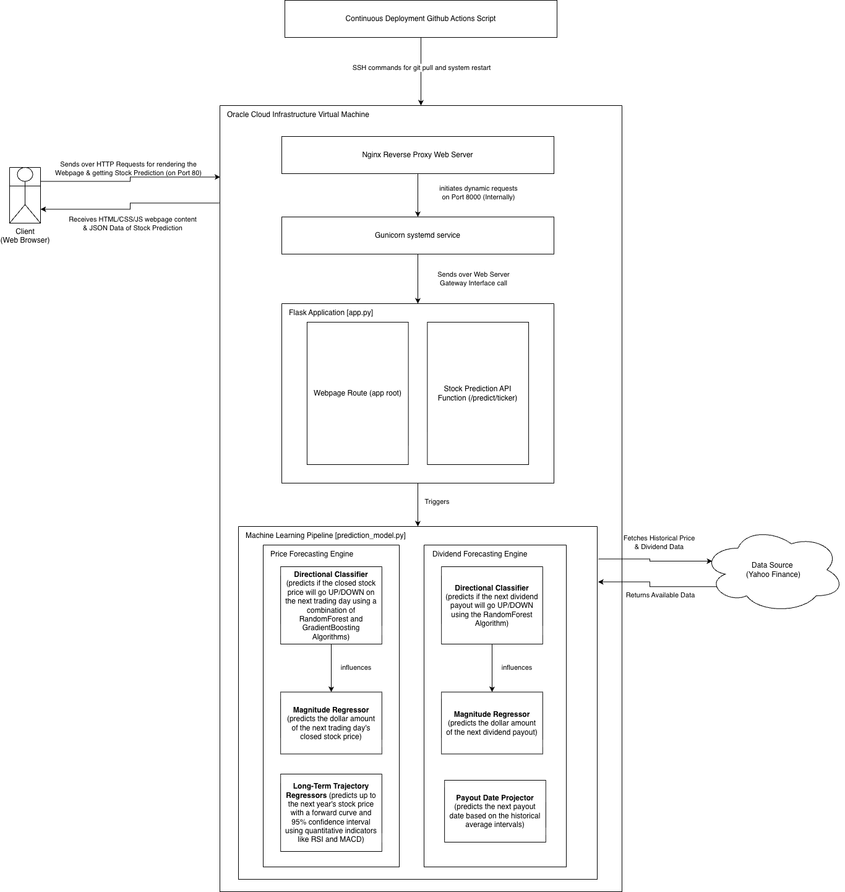

# Real-Time Stock & Dividend Forecaster

## Overview
This project is a full-stack web application designed to bridge the gap between raw financial data and a production-ready forecasting system. It provides a real-time, next-day forecast for a stock closing price alongside an intelligent projection of its next dividend payment. 

The back-end is powered by a custom-built machine learning ensemble utilizing Python and Scikit-learn. A Flask web framework serves the data. The front-end delivers a clean, responsive, and highly interactive interface built with HTML, CSS, vanilla JavaScript, and Chart.js. 

Designed for high-velocity execution and scalability, the application operates on a monolithic client-server architecture deployed on a custom-provisioned Oracle Cloud Infrastructure (OCI) environment. The deployment is fully managed by Infrastructure as Code (IaC) and an automated CI/CD pipeline.

---

## Application Architecture
To ensure enterprise-grade stability, security, and performance, this application relies on a multi-layered architecture running on a dedicated Linux virtual machine (Ubuntu 22.04 LTS).



1. **Client (Front-End):** The user browser loads the HTML, CSS, and JavaScript. The UI is decoupled from the heavy ML processing. It utilizes asynchronous `fetch` calls to ensure the interface remains responsive during model training. This includes dynamic loading states and locked inputs during execution.
2. **Web Server (Nginx Reverse Proxy):** Nginx acts as the secure front door to the application. It intercepts incoming public HTTP traffic on port 80 and buffers requests to protect the internal server from slow clients or malicious spikes. It safely proxies validated dynamic requests to the internal application layer.
3. **Application Server (Gunicorn WSGI):** Web servers and Python applications speak different protocols. Gunicorn acts as the essential Web Server Gateway Interface (WSGI) translator. It runs as a highly available background `systemd` service on internal port 8000 and manages a pool of worker processes that execute the Flask code in parallel.
4. **API & ML Execution:** The Flask routing layer handles API requests. It proxies Yahoo Finance autocomplete queries to bypass CORS restrictions. It also catches prediction requests to trigger the algorithmic pipeline. This fetches real-time data, dynamically trains and executes the machine learning models, and returns the multi-horizon forecast as structured JSON.
5. **CI/CD Pipeline:** An automated workflow that triggers on code changes to enforce strict quality control. Before any code reaches the production server, the pipeline executes security vulnerability scans, code linting, automated test suites, and static code analysis, ensuring only stable, validated code is deployed to the Oracle Cloud virtual machine.
6. **Data Source:** The external provider for all live and historical financial data. The backend interfaces with Yahoo Finance to continuously resolve partial ticker symbols for the search autocomplete, and to fetch the extensive historical price and dividend datasets required to train the machine learning models in real-time.

---

## Project File Structure
The repository is organized into cleanly separated domains to maintain strict modularity between the infrastructure, machine learning, API, and client-facing layers.

```text
stock-market-predictor/
├── .github/workflows/
│   └── deploy.yml            # Automated CI/CD pipeline configuration
├── backend/
│   ├── apis/                 # Flask routing and API endpoints
│   ├── models/               # Scikit-learn ML pipeline & data fetching
│   └── tests/                # Pytest unit and integration test suite
├── frontend/
│   ├── scripts/              # Vanilla JS, DOM manipulation, and Chart.js logic
│   ├── styles/               # UI styling and layout
│   ├── tests/                # Playwright End-to-End (E2E) browser tests
│   └── index.html            # Main web interface
├── infra/                    # Terraform Infrastructure as Code (IaC) scripts
├── app.py                    # Flask application bootloader
└── sonar-project.properties  # SonarCloud static analysis configuration
```

---

## Core Features
* **Smart Search Autocomplete:** A debounced, native search bar that proxies Yahoo Finance query API through the Flask backend to provide live, CORS-friendly ticker autocomplete.
* **Interactive Charting Engine:** A custom Chart.js interface featuring a draggable time-navigator. Users can pan and zoom seamlessly across historical market data. The chart visually explores the projected future trajectories alongside historical and in-sample prediction tooltips. The system perfectly aligns current day in-sample predictions without temporal gaps.
* **Historical Data Tables:** Automatically generates clean, scrollable trailing-year data tables for both daily closing prices and recent ex-dividend payouts.
* **Dual Forecasting Pipelines:** Independently predicts the next-day stock price (direction and magnitude) and the next projected dividend payout (amount and date) using isolated ML logic.
* **Robust Temporal Logic:** The app uses the `pandas` `CustomBusinessDay` module combined with the US Federal Holiday Calendar to accurately project exact future trading dates by skipping weekends and market closures.
* **Calibrated Confidence:** Raw machine learning models often output arbitrary scores. This app passes its directional predictions through an Isotonic `CalibratedClassifierCV` to ensure the UI reports statistically accurate, real-world confidence percentages.

---

## The Machine Learning Process
The forecasting engine abandons simple linear models in favor of dynamic feature engineering, aggressive noise reduction, and an ensemble architecture designed to minimize variance and prevent overfitting.

### 1. Data Collection & Structuring
Upon receiving a ticker symbol, the `yfinance` library retrieves the maximum available daily price and dividend history dating back to 2010. This raw data is immediately cleaned, indexed, and prepared for quantitative analysis.

### 2. Feature Engineering
Raw stock prices do not tell the model why the price is moving, and raw dividend amounts lack corporate context. The pipeline engineers a focused set of technical and fundamental features:

**Price Pipeline Features:**
* **Price Action & Momentum:** Calculates logarithmic returns and lagged returns to measure the raw signal and speed of immediate price movements.
* **Quantitative Market Indicators:**
    * **Relative Strength Index (RSI-14):** Measures the speed and change of price movements to signal "overbought" or "oversold" conditions.
    * **MACD:** Tracks the relationship between short-term and long-term exponential moving averages to quantify shifts in trend direction and momentum acceleration.
    * **Bollinger Bands:** Calculates band width for detecting volatility breakouts and the stock's position relative to the bands for dynamic support/resistance.
* **Volume Context:** Calculates short-term volume ratios to determine if there is institutional conviction behind recent price movements.

**Dividend Pipeline Features:**
* **Immediate Growth Rate:** Calculates the period-over-period percentage change to detect recent payout bumps or cuts (`Div_Growth_1`).
* **Short-Term Historical Trends:** Uses a 4-cycle (1-year) rolling average of payouts to smooth out special dividends and establish a baseline trajectory (`Rolling_Avg_4`).
* **Trailing Price Performance:** Ingests the 252-day (1-year) trailing stock price return to correlate broader corporate health and market performance with board payout decisions (`Price_Return_252`).

### 3. The Price Forecasting Engine
The price prediction pipeline is split into a highly reactive short-term model and a macro-focused long-term model.

#### The Next-Day Predictor (Short-Term)
* **The Directional Classifier:** A `RandomForestClassifier` wrapped in an Isotonic calibrator. This translates raw algorithmic margins into a true, statistically accurate probability of the stock closing UP or DOWN.
* **The Magnitude Regressor:** A `RandomForestRegressor` hyperparameter-tuned on the fly using `RandomizedSearchCV`. It tests various tree depths and leaf sizes in real-time to optimize for Negative Mean Absolute Error (MAE) and find the perfect configuration for that specific stock.
* **The Alignment Phase:** Predicting binary direction is statistically more reliable than predicting exact dollar amounts. The Classifier acts as the authoritative voice. If the Regressor raw dollar amount contradicts the Classifier direction, a custom logic block overrides the magnitude to ensure logical consistency.

#### The Long-Term Trajectory Engine
To map a full trading year (252 days), the system chains the short-term and macro models together. It explicitly takes the output of the Next-Day Magnitude Regressor to anchor the immediate trajectory at Day 1. It then trains three separate, horizon-specific regressors targeting cumulative log-returns at the 5-day, 21-day, and 252-day marks. The daily path is seamlessly stitched together using log-linear interpolation and bounded by a dynamic 95% Margin of Error band derived from historical daily volatility.

### 4. The Dividend Forecasting Engine
Corporate dividends are structured, board-approved payouts rather than market-driven trades. The application runs an isolated, parallel pipeline to predict them, sharing the same robust architecture as the price engine:

#### The Next-Payout Predictor (Short-Term)
* **The Directional Classifier:** A `RandomForestClassifier` wrapped in an Isotonic calibrator. This determines the statistical probability of the next dividend increasing, decreasing, or remaining flat based on recent fundamental features.
* **The Magnitude Regressor:** Operating in tandem with the classifier, a separate `RandomForestRegressor` uses the same fundamental context to forecast the exact dollar amount of the upcoming yield using log-growth transformations.
* **The Alignment Phase:** Just like the price pipeline, predicting binary direction is statistically more reliable than exact magnitude. The Classifier acts as the authoritative voice. If the Regressor's raw dollar amount contradicts the Classifier's direction, the magnitude is mathematically overridden to ensure logical consistency.
* **The Payout Date Projector:** The projected ex-dividend date is calculated dynamically by mapping the historical average spacing between past payouts.

#### The Long-Term Trajectory Engine
To map out a full year of passive income, the system chains the short-term and macro models together. 
* Anchoring off the next predicted payout, this module forecasts the exact dollar amount of the 2nd, 3rd, and 4th future payout cycles using horizon-specific Random Forest algorithms. 
* The multi-cycle trajectory is bounded by a dynamic 95% Margin of Error band derived from historical payout volatility.

---

## Local Development Setup
1.  **Clone the repository:**
    ```bash
    git clone [https://github.com/lc2410/stock-market-predictor.git](https://github.com/lc2410/stock-market-predictor.git)
    cd stock-market-predictor
    ```
2.  **Environment Setup (Python 3.12):**
    ```bash
    python3 -m venv venv
    source venv/bin/activate
    cd backend
    pip install -r requirements.txt
    ```
3.  **Run the Local Server:**
    ```bash
    python3 app.py
    ```
    Navigate to `http://127.0.0.1:5001` in your browser.

---

## Cloud Infrastructure (Terraform / OCI)
The production environment is hosted on an **Oracle Cloud Infrastructure (OCI)** ARM-based instance (`VM.Standard.A1.Flex` shape with 4 OCPUs and 24GB RAM). 

Rather than configuring the server manually through a web console, the entire cloud environment is strictly version-controlled and provisioned using **Terraform**. This guarantees that the network topology is reproducible, auditable, and easily deployable by anyone cloning this repository.

### Step 1: Prerequisites & Authentication
To deploy your own instance of this architecture, you must first configure Terraform to communicate securely with Oracle Cloud:
1.  **Install Terraform** on your local machine.
2.  **Generate OCI API Keys:** Create an RSA key pair in your Oracle Cloud console and copy the generated credentials.
3.  **Configure Environment Variables:** Navigate to the `infra/` directory and create a `terraform.tfvars` file (do not commit this to version control). Populate it with your specific OCI credentials (P.S. there's an existing  `terraform.tfvars.txt` file that can be renamed into the necessary `terraform.tfvars` file).
    ```hcl
    tenancy_ocid     = "ocid1.tenancy.oc1..."
    user_ocid        = "ocid1.user.oc1..."
    fingerprint      = "xx:xx:xx:xx..."
    private_key_path = "~/.oci/oci_api_key.pem"
    region           = "us-ashburn-1" # Or your local region
    compartment_ocid = "ocid1.tenancy.oc1..."
    ssh_public_key   = "ssh-rsa..."
    ```

### Step 2: Provisioning the Network and Compute Layer
The Terraform scripts in the `infra/` directory are designed to build a secure, isolated network topology from the ground up:
* **Virtual Cloud Network (VCN):** Establishes the foundational private network.
* **Internet Gateway & Route Tables:** Connects the VCN to the public internet.
* **Security Lists (Firewalls):** Strictly restricts inbound traffic. It opens **Port 22 (SSH)** for GitHub Actions automated deployments and **Port 80 (HTTP)** for public Nginx web traffic. *(Note: Port 8000 for Gunicorn is intentionally kept closed to the public internet for security, operating strictly internally).*

To provision the infrastructure, run the following commands from the `infra/` directory:
```bash
terraform init    # Initializes the OCI provider
terraform plan    # Reviews the exact infrastructure changes
terraform apply   # Provisions the VCN, Subnets, and Virtual Machine
```

---

## Testing & Code Quality
To ensure maximum reliability and prevent regressions, the application enforces strict quality gates through automated testing and static code analysis.

### 1. Backend Testing (Pytest)
A comprehensive suite of unit and integration tests validate the machine learning pipeline. Tests simulate complex edge cases including mocked Yahoo Finance outages, missing dividend histories, and sparse ticker data. Code coverage is strictly maintained at **>95%**.

**Local Execution:**
```bash
# Run tests and generate terminal coverage report
python3 -m pytest backend/tests/ --cov=. --cov-report=term
```

### 2. Frontend E2E Testing (Playwright)
Automated headless browsers simulate real human interaction. Playwright tests the full UI lifecycle, including typing into the search bar, validating loading spinners, and verifying that the API successfully returns and renders the chart data.

**Local Execution:**
```bash
# Navigate to the frontend directory and install dependencies
cd frontend
npm install
npx playwright install 

# Execute the End-to-End test suite
npm run test:frontend
```

### 3. Static Analysis & Security
* **SonarQube Cloud:** Every pull request and push is automatically scanned. It acts as a strict security gate, catching vulnerabilities, code smells, log injection risks, and enforcing test coverage minimums.
* **Security & Linting:** Python code is checked for syntactical integrity using `Flake8`. Dependency trees are scanned for known CVEs and vulnerabilities using `safety` (Python) and `npm audit` (JavaScript).

---

## CI/CD Pipeline (GitHub Actions)
The continuous integration and continuous delivery/deployment lifecycle is fully automated through a rigorous, multi-stage GitHub Actions pipeline (`deploy.yml`). Pushing a commit to the `main` branch triggers the following sequence:

1. **Security & Vulnerability Scan:** Audits Python and NPM dependencies for known CVEs.
2. **Code Linting:** Runs Flake8 to ensure Python styling and syntax standards.
3. **Automated Testing:** Boots a localized version of the app and runs both the Pytest backend suite and the Playwright E2E browser tests.
4. **Static Code Analysis:** Uploads the XML test coverage reports to SonarCloud to verify the Quality Gate passes.
5. **Zero-Downtime Deployment:** Only if all prior stages pass perfectly, the pipeline establishes a secure SSH connection to the OCI production instance, pulls the latest repository updates, and gracefully restarts the Gunicorn `systemd` service to serve the new code.

---

## Live Production Environment
The application provides a clean, responsive web interface featuring the interactive Chart.js engine to display historical trends and future forecasts.

You can access the live production environment hosted on Oracle Cloud here: [http://150.136.36.70](http://150.136.36.70)
*(Note: This is currently accessible via direct IP until domain name resolution and SSL certification are configured).*

---

## Core Technologies
* **Cloud & Infrastructure:** Oracle Cloud (OCI), Terraform, Linux (Ubuntu)
* **CI/CD & DevOps:** GitHub Actions, SonarCloud (Static Analysis)
* **Web Serving:** Nginx (Reverse Proxy), Gunicorn (WSGI)
* **Back-End:** Python, Flask
* **Machine Learning:** Scikit-learn, Pandas, NumPy
* **Data Sourcing:** yfinance (Yahoo Finance API)
* **Front-End:** HTML5, CSS3, JavaScript, Chart.js
* **Testing:** Pytest (Unit/Integration), Playwright (E2E UI Testing)